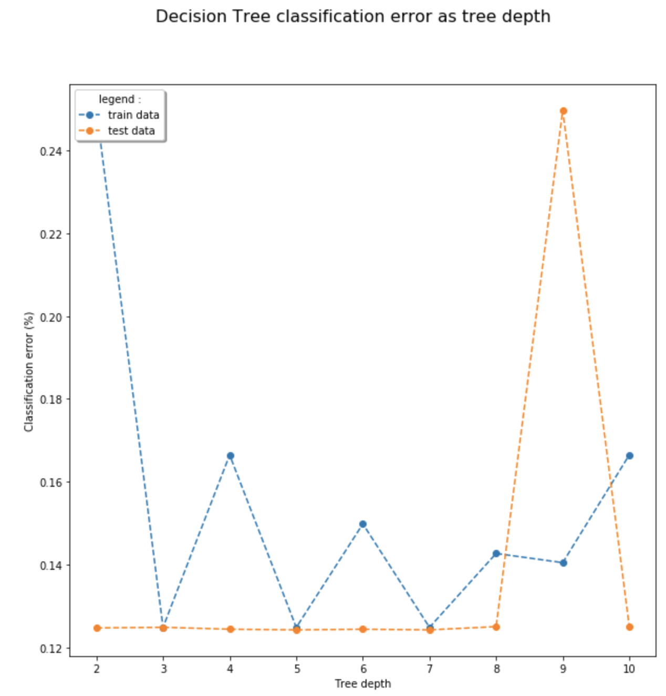

# Performance of Classifiers for Gene Expression Data Classification on PAN-CAN Dataset

DNA에서 유전자 발현의 프로필을 관찰하고 문서화를 할수 있도록 돕는 Micro-array gene expression 같은 현대 기술들은 DNA를 검사하고 연구하는데 새로운 방법을 제시하였습니다. 이로 인해 우리는 인체의 다양한 조건에서 유전자 발현이 어떻게 작용하는지에 대한 새로운 통찰력을 얻을 수 있었습니다. 특히 흥미로운 점은 종양이 유전자 발현 기능의 장애에 따른 결과라는 관점에서 이러한 기술이 암 환자를 연구하고 치료하는데 어떻게 사용될 수 있는지 연구하는 것 입니다.  

이 프로젝트는 Anaconda (Jupyter notebook) 을 이용하여 진행되었으며, 자세한 분석 방법 및 결과는 다음과 같은 추가 코드 파일 및 리포트에서 확인하실 수 있습니다.  
- [해당 연구에 대한 code 보러가기](project.ipynb)  
- [해당 연구에 대한 full report 보러가기](report.pdf)   

## Overview

이 연구에서 우리는 decision tree, k-nearest neighbour classifier, neural network and support vector machines 과 같은 다양한 데이터 마이닝 분류기의 성능을 자세히 살펴 보고, TCGA 조직에 의해 분류된 5가지 종양 유형에 대한 유전자 발현을 포함하는 PAN-CAN 데이터 세트의 하위 집합에서 더 나은 성능을 보이는 분류기를 서로 비교합니다. Decision tree classifier 의 feature selection 을 이용한 경우, 3개의 잠재적인 정보 유전자를 발견할 수 있었습니다. 연구 결과는 아직 매우 결정적이지는 않지만, 추후에 다른 데이터 세트를 사용하여 더 많은 연구를 수행한다면 데이터 마이닝을 사용한 기술이 암을 분류할 가능성을 높일 것이라 예측합니다.  

## Dataset

이 연구를 위해 선택된 데이터 세트는 ’[RNA-Seq (HiSeq) PANCAN data set](https://archive.ics.uci.edu/ml/datasets/gene+expression+cancer+RNA-Seq)’ 데이터 콜렉션의 일부입니다. PANCAN 데이터 세트는 Cancer Genome Atlas Research Network 에서 개발한 Pan-Cancer 이니셔티브 프로젝트를 위해 구성되었으며, TCGA는 다양한 암 유형에 대한 정보를 저장, 프로파일링 및 분석하는데 기여를 합니다. 해당 데이터베이스에는 RNA, DNA, 단백질 및 후성 유전 수준에 대한 수백가지 종양 유형과 하위 유형의 데이터가 포함되어 있습니다.  
PAN-CAN 프로젝트는 유사한 게놈 프로필을 기반으로 치료를 확장하기 위해 TCGA 데이터베이스에 의해 프로파일링 된 처음 12개의 종양 유형 간의 연결을 분석하기 위해 만들어졌습니다. 우리는 이 프로젝트의 전체 데이터 컬렉션 중 5개의 종양 유형에 대한 하위세트만을 가져와서 연구를 진행하였습니다:  
- Kidney renal clear cell carcinoma (KIRC)  
- Colon adenocarcinoma (COAD) 
- Lung adenocarcinoma (LUAD) 
- Prostate adenocarcinoma (PRAD) 
- Breast invasive carcinoma (BRCA) 

## Result

### Find best classifiers of the data given

#### 1. Decision Tree Classifier (DCT)  
- Graph to find optimal minimal splitting sample value for decision tree classifier  
  - Low detail:  
  - High detail:   

- Decision tree with minimal splitting sample value 100  
  

-  Graph to find optimal maximal tree depth for decision tree classifier with minimal splitting value 100  
  

#### 2. K-Nearest Neighbour Classifier (KNN)  
- Graph to find optimal number of neighbours for KNN classifier using PCA projected data  
  

#### 3. Artificial Neural Network  
- Graph for average classification error for MPC classifier of 5 learning rates computed 10 times  
  

#### 4. Support Vector Machine (SVM)  
- SVM Classification error for linear and polynomial kernel type  
  

### Compare Classifier
  

### Data Analysis
#### 1. Principle Component Analysis (PCA)  
- Graph to explained variance of the first 10 PC and of the first 300 PC  
    

#### 2. Feature Selection  
- Two Samples among 10 trees printed  
  

- Feature-selection model tree  
  

- Classification Accuracy on FreqGenes  
  
 

더 자세한 결과 분석 및 고찰은 [full report](report.pdf)를 참조하시기 바랍니다. 

